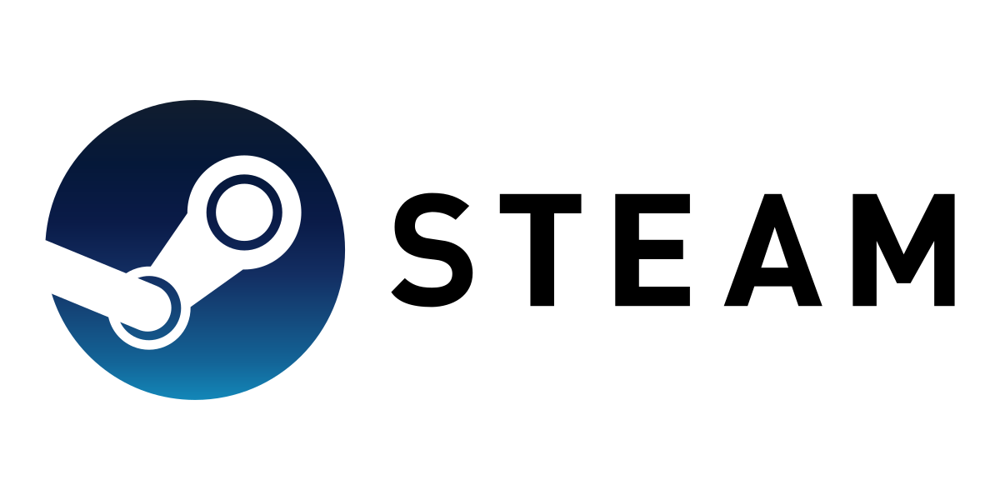
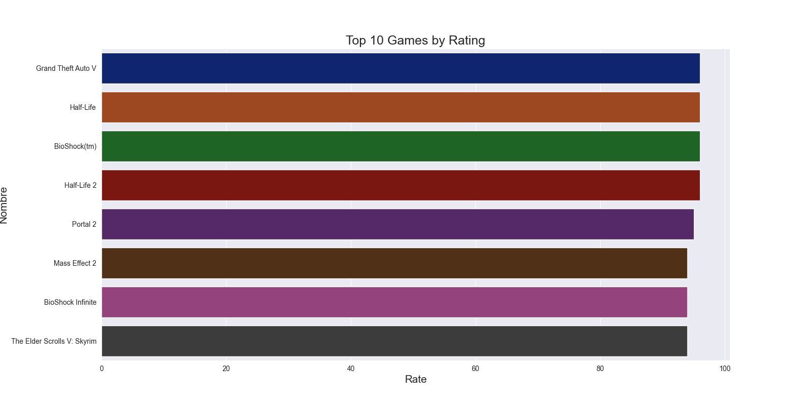
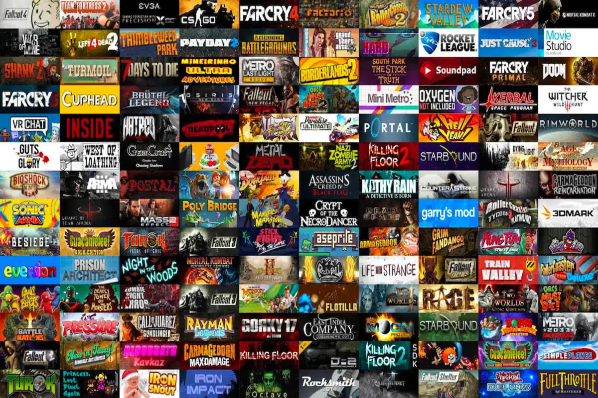

# STEAM GAMES

## Introduction
Steam is a digital video game distribution platform developed by Valve Corporation. It was released in September 2003 as a way for Valve to provide automatic updates to its games, but was eventually expanded to include third-party games. Steam offers hack protection,4​5​ matchmaking servers, video streaming, and social networking services. It also provides the user with automatic installation and updating of games and community features such as groups and friend lists, cloud saves, in-game voice and chat functionality.

It is used by both small independent developers and large software corporations for the distribution of video games and related multimedia material.

In order to enjoy all these services, it is necessary to be registered with the service by creating a free account, to which the video games purchased by the player are linked. These games can be both games offered for purchase on the platform itself and certain games purchased in physical stores.

# OBJECTIVES
·This is the first project of the Data Analytics Bootcamp on Ironhack.
·The target of this project is extract info from datasets from Kaggle and clean it. 
·in this case we'll try to answer some questions about, wich title is the most played,top rated ones and titles publisher by the owner of STEAM(Valve)

·To obtain aditional information by means of web scraping and merge it with the dataset, in order to comare and get conclusions.

·We will be asking questions as the one answer below 

            Wich games are the most rated on the steam platform? 

On top we can make us an idea about top 10 games on steam by rating.

# DATA
·The data for this analysis was taken from kaggle

·Webscrapping was made on IMDB website who give us information about all titles,genre and rating which users give to us.
·The following libraries are used: Os, Pandas, Sys, Requests, BeautifulSoup and Seaborn.
